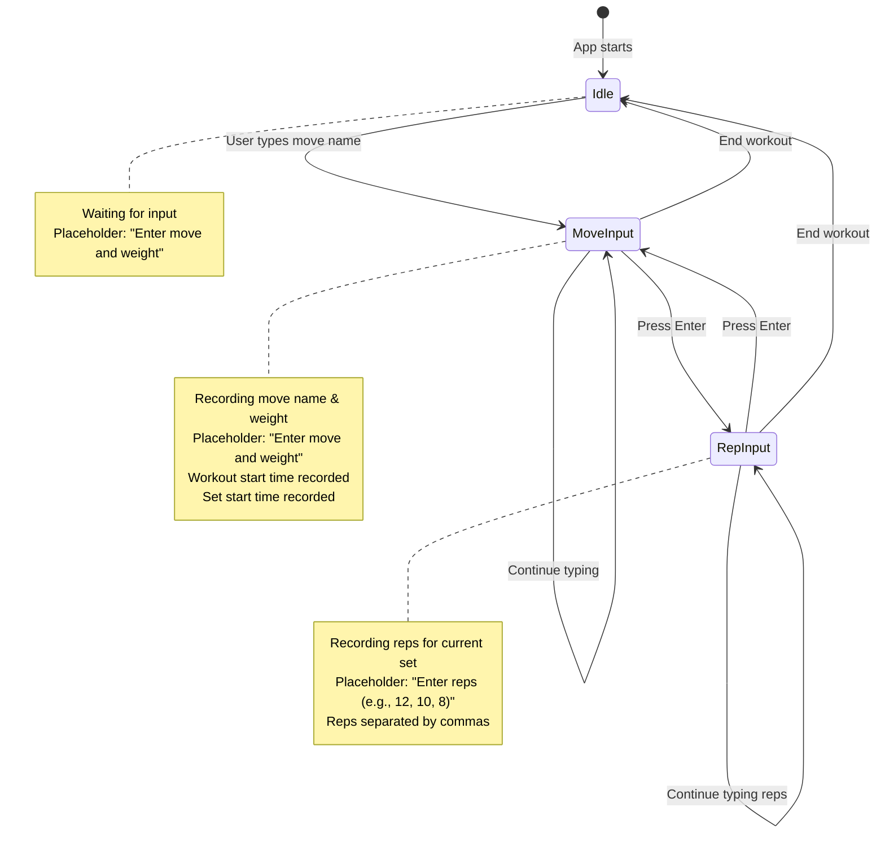

# Track Workout

A workout tracking application with dual purposes:

1. **Practical Tool**: A gym companion for tracking workouts in real-time
2. **Learning Project**: An exploration of the AnswerDotAI ecosystem and development practices

## Project Goals

- Create a practical, user-friendly workout tracking tool for gym use
- Implement modern development practices used by AnswerDotAI
- Explore and utilize the FastCore and MonsterUI ecosystem
- Maintain clean, functional code following AnswerDotAI's architectural patterns

## Data Model

### Core Entities

1. **Workout**
   - Unique identifier
   - Start time
   - End time
   - Notes
   - List of sets

2. **Move**
   - Unique identifier
   - Name
   - Weight

3. **Set**
   - Unique identifier
   - List of Moves
   - List of Reps for each Move
   - Start time
   - End time
   - Notes (e.g., "felt heavy", "form was off")

4. **Rep**
   - An integer

### Relationships

- A Workout contains multiple Sets
- A Set contains one or more Moves
- Each Move contains one or more Reps
- A Move is an arbitrary name and a weight
- 
### flow 
The ui should allow the user to specify a new set by naming a move. buttons are not used so specify a new move, instad any alpha input triggers the shift to a new move.
once a move is started, a new line changes to a new set and a space followed by a numeric indicates a new rep.
This is profoundly different than most ui/ux. the workout data below indicates the sequence of characters and button pushes for a single workout

### Example Workout Data

```
Workout start time: 1:00 PM

Sets:
    Bench Press 90 lbs
        Set start time: 1:00 PM
        Reps: 20, 20, 25, 3
        Set end time: 1:04 PM
    
    Bench Press 130 lbs
        Set start time: 1:10 PM
        Reps: 6, 6, 4, 1
        Set end time: 1:12 PM
    
    KB Swing 30 lbs
        Set start time: 1:20 PM
        Reps: 10, 10, 15
        Set end time: 1:22 PM
```

## UI/UX considerations
This is for use in a gym. We need the simplest possible interaction. For example, there will be no start workout button, instead as soon as the first move and weight are named, the workout starttime is recorded and the set starttime is recorded. The UI offers a line editor. As reps are entered, the UI appends a comma to separate counts. when the user enters return, the set is ended, the user is prompted for new move or end set.

once the foundation is in place, voice input will be adequate
start workout
    new move Dip 30 
        start set 12, 12, 10
    new move dip 20 lbs
        start set 5, 5, 1
    new move 
        kettlebell 30 
            start set 10, 8, 8
end workout

workouts, Moves, Sets all get their own timestamps. 

## User Interaction Flow

| User Action | State |
|-------------|-------|
| Enter move name and weight (e.g., "Bench Press 135") | Workout starts, move recorded, set begins |
| Press Enter after move input | Input switches to rep entry mode |
| Enter reps separated by commas (e.g., "12, 10, 8") | Reps are recorded for current set |
| Press Enter after rep input | Set ends, input switches back to move mode |
| Enter new move name and weight | New move and set begin |
| Continue entering moves and reps | Workout builds up with multiple sets |
| End workout (future feature) | Workout ends, data saved |

## State Diagram



## Setup

1. Create a virtual environment:
```bash
python -m venv venv
source venv/bin/activate  # On Windows: venv\Scripts\activate
```

2. Install dependencies:
```bash
pip install -r requirements.txt
```

## Development

This project uses:
- FastCore for core functionality
- MonsterUI for web interface
- Typer for CLI interface
- Rich for terminal formatting

## Architecture

Following AnswerDotAI practices:
- Pure functions where possible
- Clear separation of concerns
- Modern Python patterns
- Type hints and documentation

## License

MIT 